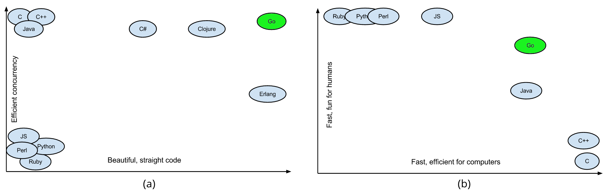
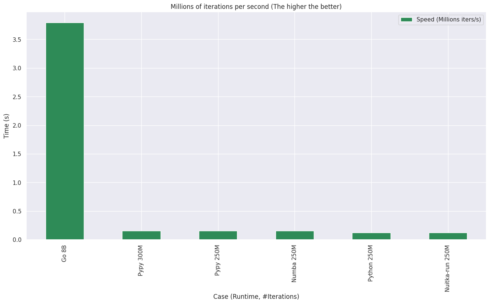
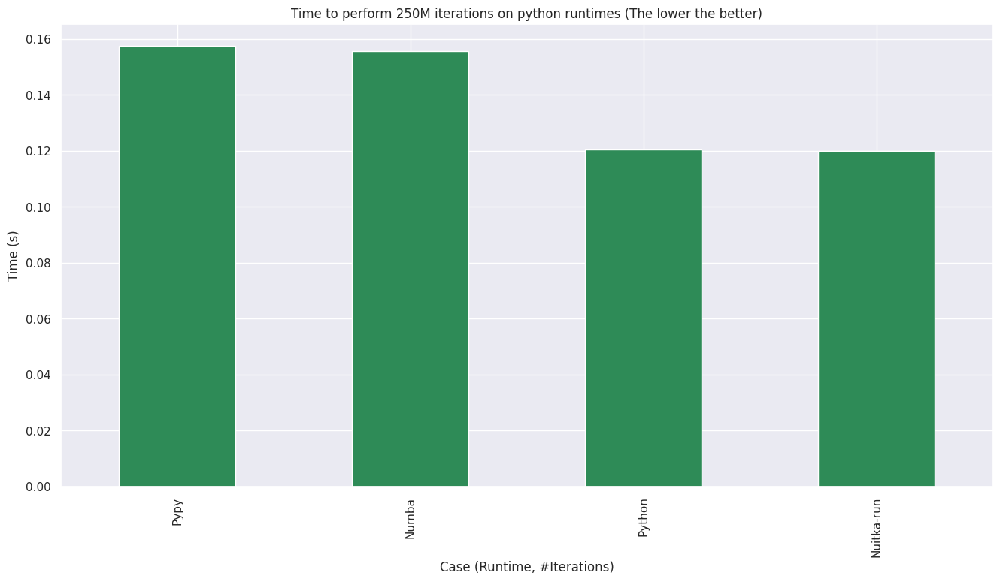
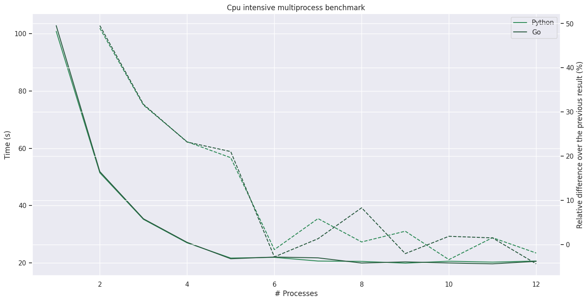
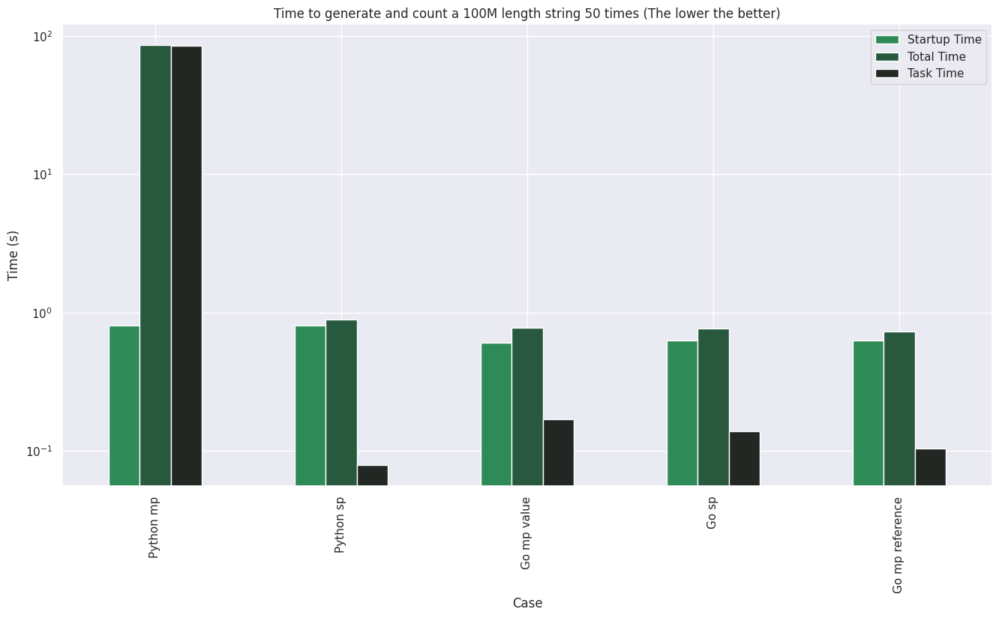
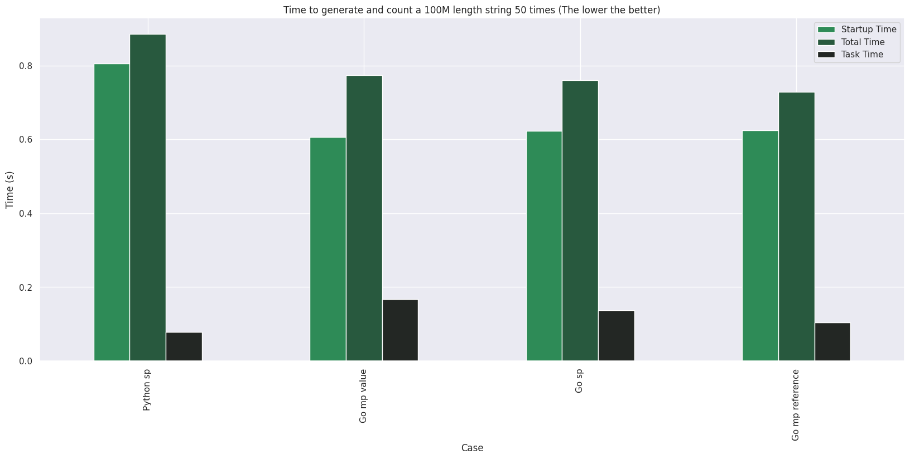

+++
title = 'Multiprocessing. Python vs Go'
description = "Let's how golang and python scale to multiple cores"
date = 2024-11-09T21:57:29+01:00
type = "post"
draft = false
image = "python-vs-go.png"
tags = ["python", "go", "concurrency", "benchmark"]
+++

All code is available on [my github repo](https://github.com/FernandoAFS/multiprocess-python-go).


# Introduction

I've been working on a embedded/electronic control project. It was started in Python because it involved machine learning to an extent and because we assume that Python is the tool for every job pretty much.

Python is a great language and it's ML libraries are second to none, but it's type system, it's dependency environment... I found it very hard to write safe code that I'm very sure about. Generating a docker image below 1.5Gb is also almost impossible.

_Image borrowed from the awesome [Bitfield Consulting](https://bitfieldconsulting.com/posts/go-vs-python)_

The more I worked with it the more I missed Go for it's compiled artefacts, performance and specially it's multiprocess capabilities.

I wanted to challenge my assumptions and check if Python multiprocess capabilities are up to the task.

## Motivation:



_Graph of beautiful code vs efficiency of concurrency. Seen at [devopedia](https://devopedia.org/go-language)_

Go has been marketed as a solution to write beautifull concurrent code. Go has an amazing syntax for concurrent programming.

I want to test to what extent this is true for simple parallel processing.

## Notes:

All tests ran in a Ryzen 5 3600 with 32Gb of Ram (4x8, 2666Mhz) using Python 3.12.7 and Go 1.23.2 in Arch Linux.

All benchmark times are given by running `perf stats` and time means total elapsed time unless stated otherwise.

# CPU intensive test:

## Function definition:

I'll use the `francois viete` pi series function as shared by [CodeDrome](https://codedrome.substack.com/p/estimating-pi-in-python). There is no practical point to iterate as many times as we are going to but it sure uses a lot of CPU if iterated through enough times.

```Python
def calcPi(iterations: int) -> float:
    numerator = 0.0
    pi = 1.0

    for _ in range(1, iterations + 1):
        numerator = math.sqrt(2.0 + numerator)
        pi *= numerator / 2.0

    return (1.0 / pi) * 2.0
```

Adapted to Go it looks like:

```Go
func calculatePi(nIter int64) (float64){

    numerator := 0.0
    pi := 1.0

    for n := int64(0); n < nIter; n++{
        numerator = math.Sqrt(2.0 + numerator)
        pi= pi * (numerator / 2.0)
    }

    return (1.0 / pi) * 2.0
}
```

## Finding a comparable single threaded task:

Before the multiprocess comparison we need to benchmark the function single-threaded. The point is to find the number of iterations that results in more or less the same CPU time for each language.

I've targeted 2s so that benchmarks are comfortable to run but it's still easy to feel the difference.

I've included Numba, Pypy and Nuitka in the mix just out of curiosity although they are not going to be part of the following benchmarks.

### Results:



Same graph without go to better compare Python environments:



| Runtime    | # Iterations |   Time |
|:-----------|:-------------|-------:|
| Go         | 8B           |   2.11 |
| Python     | 250M         |   2.09 |
| Numba      | 250M         |   1.62 |
| Nuitka-run | 250M         |   2.1  |
| Pypy       | 250M         |   1.6  |
| Pypy       | 300M         |   1.9  |

### Test Conclusions:

Golang takes the lead by a lot. It happens to be 317 times faster. If you do Go you may not need to use any multiprocessing at all.

Numba and Pypy gave a 30% performance boost while Nuitka did nothing for performance.

## Multiprocessing test:

Python and Golang will differ a lot in this one. While Go channels are the obvious choice for fan-out Python is not so straight forward.

I used async-executor since it's the most modern. It's syntactically very different from Go but conceptually they are very similar.

I ran the function 50 times. It could be much higher but I wanted to keep the benchmark comfortable.

Python:

```Python
# stock importos omitted for the sake of brevety
import dataclasses as dtcs
import functools as ft
import itertools as it
import typing as t
from concurrent import futures

T = t.TypeVar("T")
P = t.ParamSpec("P")


def calcPi(iterations: int) -> float:
    "See the last section"


@dtcs.dataclass
class ConcurrentAsyncTaskController:

    executor: futures.Executor
    loop: asyncio.AbstractEventLoop

    async def request(self, f: t.Callable[[], T]) -> T:
        try:
            return await self.loop.run_in_executor(self.executor, f)
        except RuntimeError as e:
            print("Runtime error, either not in event loop or closed executor")
            raise e


@contextlib.contextmanager
def processContext(max_workers: int):
    loop = asyncio.get_running_loop()
    with futures.ProcessPoolExecutor(max_workers=max_workers) as p:
        yield ConcurrentAsyncTaskController(p, loop)


async def main():
    N_MULTIPROC = int(sys.argv[1])
    n_iter = 25200000
    N = 50

    ls = it.repeat(n_iter, N)
    fs = map(ft.partial, it.repeat(calcPi), ls)

    with processContext(N_MULTIPROC) as ctrl:
        async with asyncio.TaskGroup() as tg:
            coros = map(ctrl.request, fs)
            list(map(tg.create_task, coros))


if __name__ == "__main__":
    asyncio.run(main())

```

This code not only uses async but map/iterators as well to keep the code concise and readable. I personally favor this kind of syntax because I find it easy to test and easy to write memory efficient code with.

Go is rather different:

```Go

package main

import () // omitted for brevity

// calculates pi iteratively through a number of iterations
func calculatePi(nIter int64) (float64){
    // Same as before

func main(){
    nProc64, err := strconv.ParseInt(os.Args[1], 10, 64)
    if err != nil{
        panic(err)
    }

    N := 50
    chArg := make(chan int64)

    var wg sync.WaitGroup
    wg.Add(int(nProc64))

    // PRODUCER
    go func(){
        var nIter int64 = 8000000000
        n := 0
        for n < N{
            n++
            chArg <- nIter
        }
        close(chArg)
    }()

    // WORKERS
    for i:=0;i< int(nProc64); i++{
        go func(){
            for arg := range chArg{
                calculatePi(arg)
            }
            wg.Done()
        }()
    }
    wg.Wait()
}
```

In go there are not that many options. This code uses one channel to distribute the argument to each worker. Once all 50 arguments are dispatched the channel is closed. The main thread waits for all workers to finish through the use of a wait group.

It follows the patterns [explained in the official go blog](https://go.dev/blog/pipelines).

### Results



**Dotted line means improvement while straight line means raw time**

|   # Proc |   Python Time (s) |     Go Time (s) |    Go Improv. (%) |     Python Improv. (%) |
|--------:|---------:|-------:|----------:|-----------:|
|       1 |   100.77 | 102.75 | N/A       | N/A        |
|       2 |    51.44 |  51.85 |  49.5377  |  48.9531   |
|       3 |    35.21 |  35.4  |  31.7261  |  31.5513   |
|       4 |    27.02 |  27.19 |  23.1921  |  23.2604   |
|       5 |    21.71 |  21.47 |  21.0371  |  19.6521   |
|       6 |    21.96 |  22.07 |  -2.7946  |  -1.15154  |
|       7 |    20.67 |  21.78 |   1.314   |   5.87432  |
|       8 |    20.55 |  19.97 |   8.31038 |   0.580552 |
|       9 |    19.93 |  20.38 |  -2.05308 |   3.01703  |
|      10 |    20.61 |  20    |   1.86457 |  -3.41194  |
|      11 |    20.29 |  19.7  |   1.5     |   1.55264  |
|      12 |    20.68 |  20.56 |  -4.36548 |  -1.92213  |


### Test conclusions

It's 100% a tie. Python has virtually no overhead.

Keep in mind that my machine has 12 threads but only 6 cores. This may help explain why there is virtually no improvement passed 5 parallel process for this example.

# Argument serialization test

I was surprised by the last test. Python requires every object to be pickled and un-pickled to communicate in and out of a sub-process. Golang would use either stack or pointers to achieve the same effect.

This time I'm going to pass a very long string and each process will return it's length. Go will have 2 implementations one value-based (stack) and another one reference-based (heap).

Python:


```Python
# SAME IMPORTS

T = t.TypeVar("T")
P = t.ParamSpec("P")


def count_l(in_list: str) -> int:
    return len(in_list)


def gen_l_str(n: int) -> str:
    return "".join(it.repeat("1", n))


@dtcs.dataclass
class ConcurrentAsyncTaskController:
    # Same code...

@contextlib.contextmanager
def processContext(max_workers: int):
    # Same code...

async def main_mp():
    N_MULTIPROC = int(sys.argv[1])
    str_l = 10**8
    N = 50

    s = gen_l_str(str_l)
    fs = map(ft.partial, it.repeat(count_l, N), it.repeat(s))

    with processContext(N_MULTIPROC) as ctrl:
        async with asyncio.TaskGroup() as tg:
            coros = map(ctrl.request, fs)
            list(map(tg.create_task, coros))


def main_sp():
    str_l = 10**8
    N = 50

    s = gen_l_str(str_l)

    for _ in range(N):
        count_l(s)


if __name__ == "__main__":
    # PARSE ARGS AND RUN MAIN_MP OR MAIN_SP

```

Go:


```Go
package main

import (
    "strconv"
    "os"
    "sync"
)

func strLen(s string) int {
	return len(s)
}

func strLenRef(s *string) int {
	return len(*s)
}

func genStrL(n int) string {
	s := make([]rune, n)
	for i := range s {
		s[i] = '1'
	}
	return string(s)
}


const N = 50
var strL = int64(math.Pow(10, 8)

func mainSp() {
	s := genStrL(strL)
	for i := 0; i < N; i++ {
		strLen(s)
	}
}

func mpVal(nProc int64) {
	s := genStrL(strL)

    chArg := make(chan string)

    // producer
    go func(){
        for i:=0; i<N; i++{
            chArg <- s
        }
        close(chArg)
    }()

    var wg sync.WaitGroup
    wg.Add(int(nProc))

    for i:=0; i<int(nProc); i++{
        go func(){
            for s := range(chArg){
                strLen(s)
            }
            wg.Done()
        }()
    }
    wg.Wait()
}

func mpRef(nProc int64) {
	s := genStrL(strL)

    chArg := make(chan *string)

    // producer
    go func(){
        for i:=0; i<N; i++{
            chArg <- &s
        }
        close(chArg)
    }()

    var wg sync.WaitGroup
    wg.Add(int(nProc))

    for i:=0; i<int(nProc); i++{
        go func(){
            for s := range(chArg){
                strLenRef(s)
            }
            wg.Done()
        }()
    }
    wg.Wait()
}

func main() {
    # RUN EITHER FUNCTION (mp or sp)
}


```

### Results

I've isolated out the time it takes to generate the string since it may not be trivial and it should not pollute the test results.

Both cases generate a string of 100 million '1's and get it's length 50 times. 

'Mp' means _multi process_ while 'sp' means _single process_.



Same image without Python multiprocess:



| Case            |   Startup Time |   Total Time |   Task Time |
|:----------------|---------------:|-------------:|------------:|
| Python sp       |       0.806038 |     0.884513 |   0.0784755 |
| Python mp       |       0.801483 |    85.9852   |  85.1837    |
| Go sp           |       0.622168 |     0.760112 |   0.137944  |
| Go mp value     |       0.605647 |     0.773528 |   0.167881  |
| Go mp reference |       0.62473  |     0.728804 |   0.104074  |


### Test Conclusions

Here we can see the weak points of Python multiprocessing. Note that objects are pickled when using queues just as much. If you have to pass large in-memory objects don't use python multi-processing.

I've skipped the number of processes used from this table since time is not affected by it. I've scaled up to 50 processes.

Even more interesting, memory usage doesn't seem to scale with processes. Profiling memory is much harder than time, Just by checking htop you see the spike in memory but it clearly does not scale with the number of processes.

I would like to test if pickle is caching the results in some way. That would explain how the first serialization is `O(N)` and `O(1)` after that...

Memory usage is comparable between the two implementations just by looking at htop.

This test is rather rudimentary. I'd love to follow it up with more practical examples.

# Conclusion:

I was surprised twice when performing this tests. First when I saw how abysmal the single-threaded performance of python is and then again when I found out how good python is taking advantage of the multiple cores of the machine.

Numba and Pypy proved to be worthy optimizations but they are very far behind what a compiled language can do.

Python multiprocess executors are good for small memory and big-cpu tasks but not for big-memory tasks. Python is not suitable for high-performance single threaded applications (not even Numba).

It would be interesting to test other tools related to Python such as [Mojo](https://www.modular.com/mojo) or [Taichi](https://www.taichi-lang.org/). These are full-blown programming languages so you cannot use the Python ecosystem. I find it easy to switch to Go (or Rust for that matter).

As machines scale to more and more cores Python will be a viable choice for somehow cpu intensive applications where latency is not critical.
